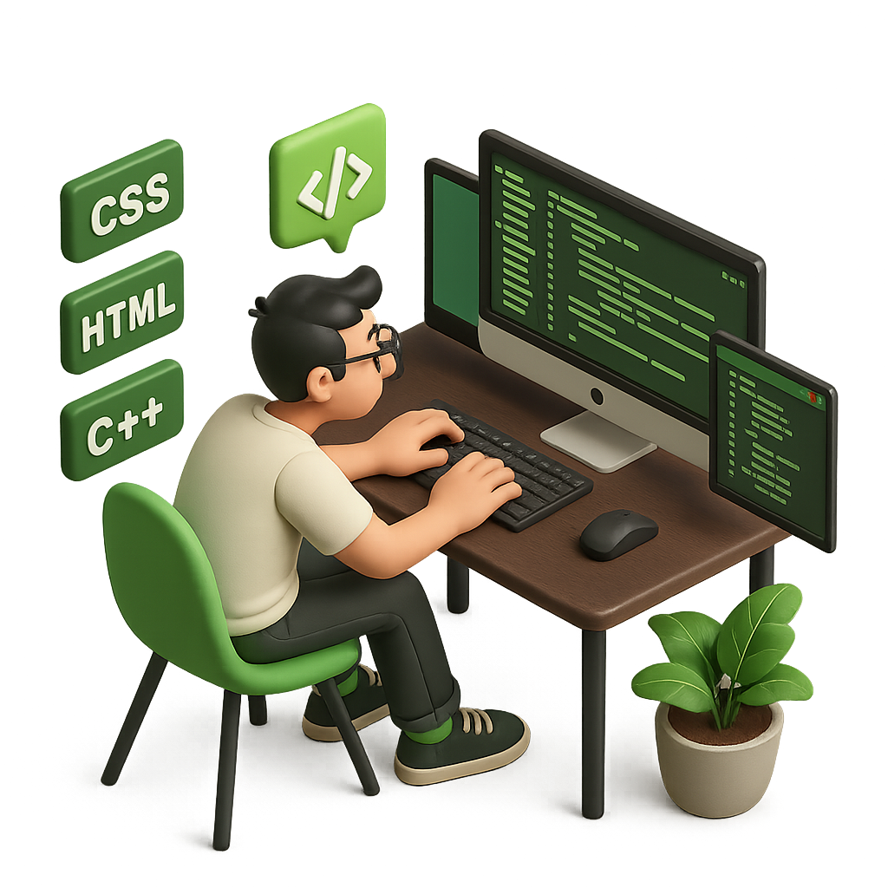

# Intervix

**Intervix** is a real-time platform for collaborative coding interviews and pair programming. Create an interview room, solve a problem in a shared editor, run code, and communicate through video and chat.



## Features

- Clerk-powered sign-in and protected routes
- Create, join, and end two-person interview sessions
- Live video calls and in-session chat with Stream
- Monaco-powered code editor with JavaScript, Python, Java, C++, and C support
- Run code through the Judge0 API (via RapidAPI)
- Curated coding-problem library with descriptions, examples, constraints, and starter code
- Dashboard for active rooms and completed sessions

## Tech stack

| Area | Technologies |
| --- | --- |
| Frontend | React, Vite, Tailwind CSS, DaisyUI, React Query, Monaco Editor |
| Backend | Node.js, Express, MongoDB, Mongoose |
| Auth & events | Clerk, Inngest |
| Real-time communication | Stream Video and Stream Chat |
| Code execution | Judge0 CE via RapidAPI |

## Project structure

```text
Intervix/
├── frontend/             # React + Vite client
│   ├── src/
│   └── public/
├── backend/              # Express API and database models
│   └── src/
└── package.json          # Deployment build/start scripts
```

## Getting started

### Prerequisites

- Node.js 22 or later
- A MongoDB database
- Accounts/keys for Clerk, Stream, Inngest, and RapidAPI (Judge0 CE)

### 1. Clone and install dependencies

```bash
git clone https://github.com/VijitSingh322/Intervix.git
cd Intervix

cd backend
npm install

cd ../frontend
npm install --legacy-peer-deps
```

### 2. Configure environment variables

Create a `.env` file in the project root:

```env
# Backend
PORT=3000
NODE_ENV=development
DB_URL=your_mongodb_connection_string
CLIENT_URL=http://localhost:5173
STREAM_API_KEY=your_stream_api_key
STREAM_API_SECRET=your_stream_api_secret
INNGEST_EVENT_KEY=your_inngest_event_key
INNGEST_SIGNING_KEY=your_inngest_signing_key

# Frontend (Vite exposes variables prefixed with VITE_)
VITE_CLERK_PUBLISHABLE_KEY=your_clerk_publishable_key
VITE_STREAM_API_KEY=your_stream_api_key
VITE_RAPID_API_KEY=your_rapidapi_key
VITE_API_URL=http://localhost:3000/api
```

> Keep this file private—never commit real API keys or database credentials.

### 3. Run locally

In one terminal, start the API:

```bash
cd backend
npm run dev
```

In a second terminal, start the client:

```bash
cd frontend
npm run dev
```

Open the local URL shown by Vite (normally `http://localhost:5173`).

## Available scripts

| Location | Command | Purpose |
| --- | --- | --- |
| `frontend` | `npm run dev` | Start the Vite development server |
| `frontend` | `npm run build` | Build the production client |
| `frontend` | `npm run lint` | Lint frontend source files |
| `backend` | `npm run dev` | Start the API with Nodemon |
| `backend` | `npm start` | Start the API with Node.js |
| project root | `npm run build` | Install dependencies and build the frontend |

## How it works

1. Sign in and choose a problem and difficulty to create an interview room.
2. Share the session link; one participant can join each active room.
3. Collaborate using the problem panel, code editor, output console, video call, and chat.
4. The host ends the session when finished; it then appears in the participants' recent sessions.

## License

This project is licensed under the ISC License.
